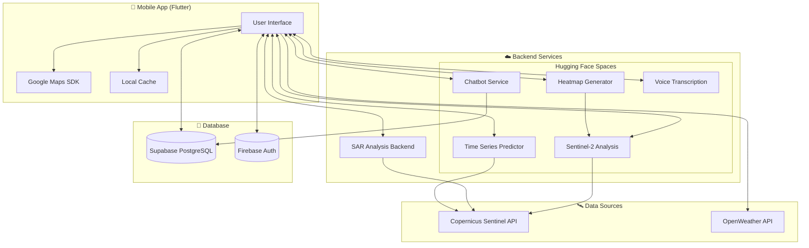
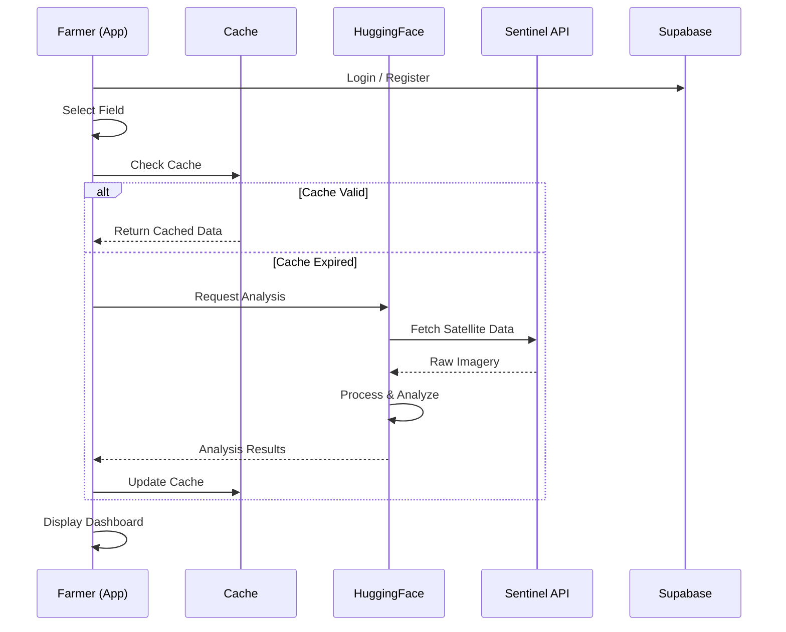

<p align="center">
  
</p>

<h1 align="center">AGROW - Smart India Hackathon 2025</h1>

<p align="center">
  <strong>Multimodal AI-ML System for Proactive Crop Health and Stress Detection</strong>
</p>

<p align="center">
  
  
  
  
  
  
</p>

<p align="center">
  <a href="#-features">Features</a> •
  <a href="#-screenshots">Screenshots</a> •
  <a href="#-architecture">Architecture</a> •
  <a href="#-installation">Installation</a> •
  <a href="#-tech-stack">Tech Stack</a> •
  <a href="#-team">Team</a>
</p>

---

## 📋 Problem Statement

| Field | Details |
|-------|---------|
| **Problem Statement ID** | SIH25099 |
| **Theme** | Agriculture, FoodTech & Rural Development |
| **Team Name** | WhatTheHack |
| **Team ID** | 86238 |
| **Category** | Software |

### The Challenge

Indian farmers face **reactive rather than proactive** crop monitoring:
- 🌾 **Late Detection**: Crop damage is only discovered after it's already occurred
- 🔬 **Technical Gap**: Sophisticated tools are inaccessible to small-scale farmers
- 📄 **Institutional Delays**: Insurance claims and government aid are slow to process

### Our Solution

AGROW provides **AI-powered early warning** through:
- 🛰️ **Satellite Intelligence**: Real-time Sentinel-2 & SAR analysis for vegetation health
- 🌱 **Soil Monitoring**: Hyperspectral imaging for moisture and nutrient levels
- 🤖 **AI Assistant**: Multilingual chatbot for personalized farming advice
- 📱 **Farmer-First Design**: Simple interface with vernacular language support

---

## ✨ Features

### 🏠 Smart Dashboard
Real-time overview of your farmland with AI-analyzed status cards:
- **Soil Health**: Moisture, salinity, and fertility indices
- **Crop Status**: Greenness, biomass, nitrogen levels, photosynthesis capacity
- **Weather Impact**: Temperature, humidity, and stress predictions
- **Risk Assessment**: Early warning for pests and diseases

### 🗺️ Interactive Field Mapping
- Tap 4 corner points to define your field boundary
- Google Maps integration with polygon visualization
- Automatic coordinate validation

### 📊 Advanced Analytics
- **Heatmaps**: Visualize field variability with color-coded overlays
- **Time Series**: Track vegetation indices over 30+ days
- **Predictions**: AI-powered forecasting for crop health trends

### 🤖 AI Chatbot (AGROW Assistant)
- **Hybrid Architecture**: Fast Lane (quick answers) + Deep Dive (detailed analysis)
- **Context-Aware**: Uses your field's satellite data for personalized responses
- **Voice Input**: Speak your questions in any language
- **Multilingual**: Supports Hindi, Marathi, Tamil, Telugu, and more

### 📍 Take Action Recommendations
- Actionable insights based on detected stress patterns
- Irrigation scheduling based on soil moisture
- Nutrient management suggestions

---

## 📸 Screenshots

> **Note**: Add your screenshots to a `screenshots/` folder and update the paths below.

### Onboarding & Authentication

| Landing Screen | Login | Registration |
|:-------------:|:-----:|:------------:|
|  |  |  |

### Main Dashboard

| Home Screen (Light) | Home Screen (Dark) | Field Selector |
|:------------------:|:------------------:|:--------------:|
|  |  |  |

### Status Cards

| Soil Status | Crop Status | Weather | Pest Risk |
|:-----------:|:-----------:|:-------:|:---------:|
|  |  |  |  |

### Field Mapping

| Locate Farmland | Coordinate Entry | Field Preview |
|:---------------:|:----------------:|:-------------:|
|  |  |  |

### Analytics & Visualization

| Analytics Dashboard | Heatmap View | Time Series |
|:-------------------:|:------------:|:-----------:|
|  |  |  |

### AI Chatbot

| Chat Interface | Voice Input | Chat History |
|:--------------:|:-----------:|:------------:|
|  |  |  |

### Take Action

| Recommendations | Irrigation Schedule | Field Variability |
|:---------------:|:-------------------:|:-----------------:|
|  |  |  |

---

## 🏗️ Architecture



### Data Flow



---

## 🚀 Installation

### Prerequisites

- **Flutter SDK** 3.9.0 or higher
- **Dart SDK** 3.9.0 or higher
- **Android Studio** or **VS Code** with Flutter extensions
- **Xcode** (for iOS development on macOS)
- **Google Maps API Key**
- **Supabase Project** (for database)
- **Firebase Project** (for authentication)

### Step 1: Clone the Repository

```bash
git clone https://github.com/your-username/agroww_sih.git
cd agroww_sih
```

### Step 2: Environment Setup

Create a `.env` file in the root directory:

```env
# Supabase Configuration
SUPABASE_URL=https://your-project.supabase.co
SUPABASE_ANON_KEY=your_supabase_anon_key

# Google Maps
GOOGLE_MAPS_API_KEY=your_google_maps_api_key

# Backend Services (Hugging Face Spaces)
HF_CHATBOT_URL=https://your-space.hf.space/chatbot
HF_SENTINEL2_URL=https://your-space.hf.space/sentinel2
HF_HEATMAP_URL=https://your-space.hf.space/heatmap
HF_TIMESERIES_URL=https://your-space.hf.space/timeseries
```

### Step 3: Configure Google Maps

**Android** (`android/app/src/main/AndroidManifest.xml`):
```xml
<meta-data
    android:name="com.google.android.geo.API_KEY"
    android:value="YOUR_API_KEY"/>
```

**iOS** (`ios/Runner/AppDelegate.swift`):
```swift
GMSServices.provideAPIKey("YOUR_API_KEY")
```

### Step 4: Install Dependencies

```bash
flutter pub get
```

### Step 5: Run the App

```bash
# For debug mode
flutter run

# For release mode
flutter run --release

# For specific device
flutter run -d <device_id>
```

---

## 🛠️ Tech Stack

### Frontend (Mobile App)

| Technology | Purpose |
|------------|---------|
| **Flutter 3.x** | Cross-platform UI framework |
| **Dart 3.x** | Programming language |
| **Provider** | State management |
| **Google Maps SDK** | Interactive mapping |
| **FL Chart** | Data visualization |
| **Flutter Markdown** | Rich text rendering |

### Backend Services

| Service | Technology | Deployment |
|---------|------------|------------|
| **Chatbot** | Python, Groq LLM | Hugging Face Spaces |
| **Sentinel-2 Analysis** | Python, Sentinel Hub | Hugging Face Spaces |
| **Heatmap Generator** | Python, NumPy | Hugging Face Spaces |
| **Time Series** | Python, Prophet | Hugging Face Spaces |
| **SAR Analysis** | Python, FastAPI | Hugging Face Spaces |

### 🤗 Hugging Face Space Repositories

| Service | Repository (Files) |
|---------|-------------------|
| **Chatbot** | [Aniket2006/Chatbot](https://huggingface.co/spaces/Aniket2006/Chatbot/tree/main) |
| **Sentinel-2 Analysis** | [aniket2006/agrow-sentinel2](https://huggingface.co/spaces/aniket2006/agrow-sentinel2/tree/main) |
| **Heatmap Generator** | [aniket2006/heatmap](https://huggingface.co/spaces/aniket2006/heatmap/tree/main) |
| **Time Series** | [Aniket2006/TimeSeries](https://huggingface.co/spaces/Aniket2006/TimeSeries/tree/main) |
| **Voice Transcription** | [aniket2006/agrow-voice](https://huggingface.co/spaces/aniket2006/agrow-voice/tree/main) |
| **SAR Backend** | [aniket2006/agrow-backend-v2](https://huggingface.co/spaces/aniket2006/agrow-backend-v2/tree/main) |

### Data & Infrastructure

| Component | Technology |
|-----------|------------|
| **Database** | Supabase (PostgreSQL) |
| **Authentication** | Firebase Auth |
| **Push Notifications** | Firebase Cloud Messaging |
| **Satellite Data** | Copernicus Sentinel Hub API |
| **Weather Data** | OpenWeather API |

---

## 📁 Project Structure

```
agroww_sih/
├── lib/                          # Flutter source code
│   ├── main.dart                 # App entry point
│   ├── models/                   # Data models (57 files)
│   ├── screens/                  # UI screens (49 files)
│   │   ├── home_screen.dart      # Main dashboard
│   │   ├── chatbot_screen.dart   # AI assistant
│   │   ├── analytics_screen.dart # Data visualization
│   │   └── ...
│   ├── services/                 # Business logic (14 files)
│   │   ├── chatbot_service.dart  # Chatbot API integration
│   │   ├── sentinel2_service.dart # Satellite analysis
│   │   ├── cache_service.dart    # Local data caching
│   │   └── ...
│   └── widgets/                  # Reusable components (8 files)
│       ├── heatmap_widget.dart   # Heatmap visualization
│       ├── timeseries_chart_widget.dart
│       └── ...
├── hf_deploy/                    # Hugging Face deployments
│   ├── SAR-Analysis/             # SAR analysis service (Core Backend)
│   │   ├── app.py                # FastAPI server
│   │   ├── SAR_prediction.py     # SAR analysis pipeline
│   │   └── gemini_llm_integration.py
│   ├── Chatbot/                  # AI chatbot service
│   ├── AGROW-Sentinel2/          # Sentinel-2 analysis
│   ├── Heatmap/                  # Heatmap generation
│   ├── TimeSeries/               # Time series forecasting
│   └── Voice/                    # Voice transcription
├── assets/                       # Images, icons, videos
├── android/                      # Android-specific config
├── ios/                          # iOS-specific config
└── pubspec.yaml                  # Flutter dependencies
```

---

## 🔧 Configuration

### Firebase Setup

1. Create a Firebase project at [console.firebase.google.com](https://console.firebase.google.com)
2. Enable Authentication (Email/Password, Google Sign-In)
3. Download `google-services.json` (Android) and `GoogleService-Info.plist` (iOS)
4. Place files in appropriate directories

### Supabase Setup

1. Create a Supabase project at [supabase.com](https://supabase.com)
2. Run the SQL setup script:
   ```bash
   psql -h your-project.supabase.co -U postgres -d postgres -f supabase_setup.sql
   ```
3. Copy the project URL and anon key to `.env`

### Hugging Face Spaces

Deploy each service in `hf_deploy/` to Hugging Face Spaces:

```bash
# Example for Chatbot
cd hf_deploy/Chatbot
git init
git add .
git commit -m "Initial deploy"
huggingface-cli repo create your-chatbot-space --type space
git remote add hf https://huggingface.co/spaces/your-username/your-chatbot-space
git push hf main
```

---

## 🧪 Testing

```bash
# Run all tests
flutter test

# Run with coverage
flutter test --coverage

# Analyze code
flutter analyze
```

---

## 👥 Team

**Team WhatTheHack (ID: 86238)**

| Name | Role |
|------|------|
| Aniket Mandal | Team Lead / App Developer |
| Adith Jayakrishnan | AI/ML Engineer |
| Achyuth A | AI/ML Engineer |
| Aditya Chauhan | UI/UX Designer and Product Researcher |
| Dhyan Shah | UI/UX Designer and Product Researcher |
| Priti Nag | Operations & Strategy |

---

## 📄 License

This project was developed for Smart India Hackathon 2025.

---

## 🙏 Acknowledgments

- **Copernicus Programme** for Sentinel satellite data
- **Google** for Maps SDK and Firebase services
- **Supabase** for database infrastructure
- **Hugging Face** for model hosting
- **Indian Space Research Organisation (ISRO)** for inspiration

---

<p align="center">
  <strong>Built with ❤️ for Indian Farmers</strong>
</p>

<p align="center">
  
</p>
