<p align="center">
  
</p>

<h1 align="center">AGROW</h1>

<h2 align="center">🏆 WINNER - Smart India Hackathon 2025 🏆</h2>

<p align="center">
  <strong>Multimodal AI-ML System for Proactive Crop Health and Stress Detection</strong>
</p>

<p align="center">
  
  
  
  
  
  
</p>

<p align="center">
  <a href="#-features">Features</a> •
  <a href="#-screenshots">Screenshots</a> •
  <a href="#-architecture">Architecture</a> •
  <a href="#-installation">Installation</a> •
  <a href="#-tech-stack">Tech Stack</a> •
  <a href="#-team">Team</a>
</p>

---

## 📋 Problem Statement

| Field | Details |
|-------|---------|
| **Problem Statement ID** | SIH25099 |
| **Theme** | Agriculture, FoodTech & Rural Development |
| **Team Name** | WhatTheHack |
| **Team ID** | 86238 |
| **Category** | Software |

### The Challenge

Indian farmers face **reactive rather than proactive** crop monitoring:
- 🌾 **Late Detection**: Crop damage is only discovered after it's already occurred
- 🔬 **Technical Gap**: Sophisticated tools are inaccessible to small-scale farmers
- 📄 **Institutional Delays**: Insurance claims and government aid are slow to process

### Our Solution

AGROW provides **AI-powered early warning** through:
- 🛰️ **Satellite Intelligence**: Real-time Sentinel-2 & SAR analysis for vegetation health
- 🌱 **Soil Monitoring**: Hyperspectral imaging for moisture and nutrient levels
- 🤖 **AI Assistant**: Multilingual chatbot for personalized farming advice
- 📱 **Farmer-First Design**: Simple interface with vernacular language support

---

## ✨ Features

### 🏠 Smart Dashboard
Real-time overview of your farmland with AI-analyzed status cards:
- **Soil Health**: Moisture, salinity, and fertility indices
- **Crop Status**: Greenness, biomass, nitrogen levels, photosynthesis capacity
- **Weather Impact**: Temperature, humidity, and stress predictions
- **Risk Assessment**: Early warning for pests and diseases

### 🗺️ Interactive Field Mapping
- Tap 4 corner points to define your field boundary
- Google Maps integration with polygon visualization
- Automatic coordinate validation

### 📊 Advanced Analytics
- **Heatmaps**: Visualize field variability with color-coded overlays
- **Time Series**: Track vegetation indices over 30+ days
- **Predictions**: AI-powered forecasting for crop health trends

### 🤖 AI Chatbot (AGROW Assistant)
- **Hybrid Architecture**: Fast Lane (quick answers) + Deep Dive (detailed analysis)
- **Context-Aware**: Uses your field's satellite data for personalized responses
- **Voice Input**: Speak your questions in any language
- **Multilingual**: Supports Hindi, Marathi, Tamil, Telugu, and more

### 📍 Take Action Recommendations
- Actionable insights based on detected stress patterns
- Irrigation scheduling based on soil moisture
- Nutrient management suggestions

---

## 📸 Screenshots

### Onboarding & Authentication

| First Screen | Login | Registration |
|:------------:|:-----:|:------------:|
|  |  |  |

### Permissions & Intro

| Location Permission | Notification Permission | Intro Page |
|:-------------------:|:-----------------------:|:----------:|
|  |  |  |

### Status Dashboard

| Weather Status | Crop Status | Pest Risk | Soil Status |
|:--------------:|:-----------:|:---------:|:-----------:|
|  |  |  |  |

### AI Chatbot

| Chatbot |
|:-------:|
|  |

### Field Management

| Add Field |
|:---------:|
|  |

### Take Action

| Irrigation Scheduling | Vegetation Health |
|:---------------------:|:-----------------:|
|  |  |

### Analytics & Visualization

| Soil Time Series | Export Analytics | Heatmap |
|:----------------:|:----------------:|:-------:|
|  |  |  |

### Notes

| Notes Page | Notes Page 2 |
|:----------:|:------------:|
|  |  |

### Settings & Profile

| Settings Sidebar | Profile | Notifications | Language |
|:----------------:|:-------:|:-------------:|:--------:|
|  |  |  |  |

---

## 🏗️ Architecture

```mermaid
flowchart TB
    subgraph USER["📱 Mobile App (Flutter)"]
        UI[User Interface]
        MAPS[Google Maps SDK]
        CACHE[Local Cache]
    end
    
    subgraph BACKEND["☁️ Backend Services"]
        subgraph HF["Hugging Face Spaces"]
            CHAT[Chatbot Service]
            S2[Sentinel-2 Analysis]
            HEAT[Heatmap Generator]
            TS[Time Series Predictor]
            VOICE[Voice Transcription]
        end
        SAR[SAR Analysis Backend]
    end
    
    subgraph DATA["🛰️ Data Sources"]
        SENTINEL[Copernicus Sentinel API]
        WEATHER[OpenWeather API]
    end
    
    subgraph DB["💾 Database"]
        SUPA[(Supabase PostgreSQL)]
        FIRE[(Firebase Auth)]
    end
    
    UI --> MAPS
    UI --> CACHE
    UI <--> CHAT
    UI <--> S2
    UI <--> HEAT
    UI <--> TS
    UI <--> VOICE
    UI <--> SAR
    
    CHAT --> SUPA
    S2 --> SENTINEL
    SAR --> SENTINEL
    TS --> SENTINEL
    HEAT --> S2
    
    UI <--> SUPA
    UI <--> FIRE
    UI --> WEATHER
```



### Data Flow


---

## �️ AI/ML Pipeline: Orbital Intelligence

### Executive Summary

The modern landscape of environmental monitoring is characterized by a data deluge, where the challenge lies not in acquisition but in the extraction of actionable intelligence from raw satellite substrates. This report details a sophisticated "Orbital Intelligence" pipeline designed to forecast agricultural states. The system integrates a geospatial ingestion layer, a multi-modal sensor fusion mechanism (Optical and Radar), and a specialized deep learning architecture known as N-HITS (Neural Hierarchical Interpolation for Time Series). Unlike generic Transformer-based models, this pipeline utilizes signal processing principles to achieve biological plausibility and computational efficiency.


### 1. The Geospatial Ingestion Layer: From Coordinates to Data Cubes

The pipeline’s entry point converts a simple coordinate pair (latitude/longitude) into a four-dimensional historical archive. This process involves complex geometric transformations to align user inputs with satellite reference systems.

- **Grid Projection**: User coordinates (typically WGS84/EPSG:4326) are projected onto the Military Grid Reference System (MGRS) used by missions like Sentinel-2. The system identifies specific 100x100 km tiles (granules) intersecting the Region of Interest (ROI).
- **Spatial Intersection**: To ensure data density, the pipeline calculates a bounding box around the coordinate to query all intersecting granules, capturing observations from overlapping orbital tracks.
- **Temporal Resolution**: The system manages the stochastic nature of satellite revisit times (approx. 5 days for Sentinel-2) by creating a "Target Time Grid," resampling irregular acquisitions into a regular interval using quality flags to mitigate atmospheric noise.
- **The Mixed Pixel Problem**: To address spatial resolution limitations (10m for Sentinel-2), the pipeline fetches a "patch" (e.g., 3x3 pixels) rather than a single point, utilizing spatial aggregation (median values) to reduce geolocation errors and noise.

### 2. The Sensorium: Multi-Modal Data Fusion

To overcome the limitations of single-source sensing, the pipeline orchestrates a fusion of passive Optical radiometry and active Synthetic Aperture Radar (SAR).


#### 2.1 Optical Radiometry (Sentinel-2)
This stream captures solar reflectance across 13 spectral bands, serving as the "chemical signature" of the crop.
- **Spectral Physics**: The pipeline prioritizes "Red Edge" bands (B5, B6, B7), which measure the transition between red absorption and Near-Infrared (NIR) reflectance—a critical proxy for chlorophyll content.
- **Vegetation Indices**: The system computes indices such as the Normalized Difference Vegetation Index (NDVI) to track phenological cycles.
- **The Atmospheric Barrier**: A major limitation is cloud cover, which renders optical pixels as "Missing Data" (NaN). In tropical regions, up to 60% of time series data may be lost to cloud occlusion.

#### 2.2 Synthetic Aperture Radar (Sentinel-1)
To mitigate optical data loss, the pipeline employs C-band microwave pulses (~5.6 cm wavelength) which penetrate clouds, fog, and smoke.
- **Backscatter Physics**: The system analyzes backscatter (σ⁰) to determine physical structure (roughness) and dielectric properties (moisture content).
- **Polarisation Channels**:
  - **VV (Vertical-Vertical)**: Interacts strongly with vertical structures like wheat stalks.
  - **VH (Vertical-Horizontal)**: Captures volume scattering within the canopy, serving as a proxy for biomass density.

#### 2.3 Feature-Level Fusion
The fusion module aligns the timestamps of Radar and Optical data into a unified tensor. The deep learning model implicitly learns the correlation between Radar backscatter and Optical indices, allowing it to infer vegetation states from Radar data alone when Optical data is missing.

### 3. The Predictive Engine: N-HITS Architecture

The core of the pipeline is the N-HITS (Neural Hierarchical Interpolation for Time Series) model. It is selected over Transformer architectures due to the latter's computational cost (O(L²)) and lack of inductive bias for smoothness.

#### 3.1 Hierarchical Decomposition
N-HITS operates on the principle of "Divide and Conquer via Frequency," premised on the understanding that agricultural time series are composites of distinct signal frequencies. The architecture decomposes the forecasting problem into three specialized components:
- **Trend Component (Low Frequency)**: Captures gradual, monotonic changes such as crop maturation over a season.
- **Seasonality Component (Medium Frequency)**: Captures recurring cyclic patterns, such as annual wet/dry cycles.
- **Detail Component (High Frequency)**: Captures stochastic fluctuations and immediate noise, often driven by wind or sensor artifacts.

#### 3.2 Multi-Rate Data Sampling
To isolate these components, the model employs Multi-Rate Data Sampling, effectively analyzing the input tensor at varying resolutions.
- **The Trend Specialist (Block 1)**: Ingests a highly subsampled input (e.g., 1 point every 10 days). By viewing a coarse-grained representation, this block becomes "blind" to high-frequency noise, allowing it to model the macroscopic growth trajectory exclusively.
- **The Seasonal Specialist (Block 2)**: Processes data at medium resolution to extract monthly or weekly periodicities.
- **The Detail Specialist (Block 3)**: Processes high-resolution, daily data to model immediate variations.

#### 3.3 Neural Basis Expansion
Unlike standard Multi-Layer Perceptrons (MLPs) that output independent point-wise predictions, N-HITS utilizes Neural Basis Expansion to enforce continuity. The network predicts a small set of coefficients which are then projected onto mathematical basis functions (such as polynomials or Fourier series).
- **Mathematical Constraint**: By limiting the number of coefficients (e.g., using 5 coefficients to define a 100-day curve), the model is mathematically constrained to produce a smooth output. This interpolation prevents the generation of jagged, erratic forecasts, ensuring the output respects the physical inertia of biological systems.

### 4. Automated Adaptation Strategy

The `auto_tuning_predictor` (specifically the `AutoNHITS` class) addresses the challenge of spatial heterogeneity. Because crop phenology and environmental response functions vary drastically across the globe—from wheat fields in France to soy plantations in Brazil—a static model architecture is insufficient.


#### 4.1 The High-Dimensional Search Space
To optimize performance for a specific geospatial coordinate, the pipeline must navigate a complex hyper-parameter space. Key structural parameters include:
- **Input Horizon**: The length of historical context required (Lookback Window).
- **Kernel Size**: The aggressiveness of the subsampling pooling layers.
- **Network Depth**: The number of layers required to capture signal complexity.

#### 4.2 Bayesian Optimization via Tree-Structured Parzen Estimators (TPE)
The pipeline automates the role of the data scientist by executing an optimization loop utilizing efficient search algorithms like Tree-structured Parzen Estimators (TPE).
1. **Trial Generation**: The system spawns multiple model instances ("trials") with varying architectural configurations.
2. **Adaptive Pruning**: Unlike Grid Search (which exhaustively tests all combinations) or Random Search, TPE learns from the history of trials. If the algorithm detects that large kernel sizes yield high error metrics (e.g., MAE or CRPS) on the validation set, it effectively prunes that region of the search space.
3. **Convergence**: This adaptive learning allows the `auto_tuning_predictor` to converge on an optimal, location-specific architecture in a fraction of the computational time required by traditional methods, ensuring scalability across millions of coordinates.

### 5. Qualitative Superiority: Beyond Numerical Error Metrics

While numerical accuracy (RMSE/MAE) is standard, we emphasize qualitative superiority, defining the "behavioral" quality of the forecast which determines user trust and operational utility.

- **Biological Plausibility**: Unlike Transformers that may latch onto noise and produce jagged predictions, N-HITS' hierarchical interpolation produces smooth, continuous curves that mimic organic growth. The model captures the physical inertia of vegetation.
- **Interpretability**: The architecture inherently decomposes the forecast into Trend, Seasonality, and Detail stacks, effectively allowing "Visual Debugging" of the model's reasoning.
- **Long-Horizon Stability**: By using Direct Multi-Step Forecasting (predicting all future points simultaneously), we avoid the error propagation typical of autoregressive models (RNNs/LSTMs), ensuring stability for 90-day harvest forecasts.
- **Computational Efficiency ("Green AI")**: N-HITS trains up to 50x faster than Transformers, reducing carbon footprint and allowing compute budget to be reallocated to the detailed `auto_tuning_predictor` loops.

### 🤖 Prompt Engineering & Context-Awareness

The AGROW Assistant goes beyond standard RAG (Retrieval Augmented Generation) by constructing dynamically engineered prompts that act as a "Contextual Container" for the LLM.

#### The Context Injection Protocol
Instead of generic system prompts, every user query is wrapped in a high-fidelity context block containing live telemetry:
- **Satellite Telemetry**: The prompt includes the latest computed NDVI, NDRE, and Moisture values (e.g., *"NDVI is 0.42, trending down 10% from last week"*).
- **Agronomic Grounding**: We inject specific crop parameters (e.g., *"Current crop is Wheat at Vegetative Stage 3"*).
- **Location Specificity**: Coordinates and local weather forecasts are embedded to ground the advice in physical reality.

#### System Instructions & Guardrails
The LLM is strictly instructed via system prompts to:
1. **Prioritize Data**: "Answer based STRICTLY on the provided telemetry values. Do not give generic advice if data contradicts it."
2. **Cite Evidence**: "When recommending irrigation, cite the current Soil Moisture Index (0.3) as the reason."
3. **Avoid Hallucination**: "If satellite data is cloudy/missing, state that explicitly rather than inventing values."

This tailored prompt engineering turns the LLM from a generic chatbot into a data-driven agronomic consultant.

---

## 🧬 Deep Multi-Modal Fusion: Stress Detection & Logic

### Executive Summary

Remote sensing has revolutionized agricultural monitoring by enabling the observation of crop health at unprecedented spatial and temporal scales. However, optical sensors like Sentinel-2 frequently suffer from cloud occlusion, which severely disrupts temporal continuity and data reliability. To address this, we developed a robust, multi-modal machine learning pipeline that integrates optical imagery with Synthetic Aperture Radar (SAR) data from Sentinel-1. Unlike optical sensors, SAR penetrates cloud cover and operates independently of weather and illumination, making it an ideal complementary modality.

The architecture synthesizes vegetation indices, spectral signatures, and SAR backscatter patterns. The workflow progresses from raw data acquisition through extensive preprocessing—including SAR speckle filtering and **Deep Sentinel-2 Cloud Removal (DSen2-CR)**—to a deep learning framework capable of spatio-temporal encoding. By utilizing **3D Convolutional Neural Networks (CNNs)** for spatial features and **BiLSTM/Transformer** models for temporal sequences, the system effectively identifies moisture deficits, pest onset, and soil nutrient stress through unsupervised K-Means clustering and anomaly detection.


### 1. Objectives

1. **Fuse** Sentinel-1 SAR and Sentinel-2 optical data for all-weather stress detection.
2. **Perform Cloud Removal** using DSen2-CR.
3. **Compute Indices** tailored to crop stress (Vegetation & Soil).
4. **Train Deep Learning Models** on spatial–temporal satellite sequences.
5. **Cluster & Detect Anomalies** to identify stress intensities.
6. **Generate Agronomic Insights** using logic-driven LLM reasoning.

### 2. Data Sources

| Source | Sensor | Details |
|--------|--------|---------|
| **Sentinel-2 MSI** | Optical | Level-2A (Atmospherically Corrected). 13 spectral bands (Visible, Red Edge, NIR, SWIR). |
| **Sentinel-1 SAR** | Radar | IW GRD Mode. C-band dual-polarization (VV + VH). Critical for cloud penetration. |
| **OpenMeteo** | Weather | Meteorological context (temperature, precipitation) for the LLM reasoning engine. |

### 3. Mathematical Framework & Algorithmic Formulations


#### 3.1 Sentinel-1 SAR Processing
Microwave backscatter (σ⁰) is processed to determine structure and wetness.

**Backscatter Equation**:
```math
σ⁰ = (Pr * R⁴) / (Pt * Gt * Gr * λ²)
```

**dB Conversion**:
```math
σ⁰_dB = 10 * log10(σ⁰)
```

**Radar Vegetation Index (RVI)** (Proxy for biomass density):
```math
RVI = (4 * σ⁰_VH) / (σ⁰_VV + σ⁰_VH)
```

#### 3.2 Sentinel-2 Optical Cloud Removal (DSen2-CR)
Cloud pixels are reconstructed using a ResNet-like encoder-decoder fused with SAR data.

**Input Tensor**: `X = [S2_cloudy, SAR_VV, SAR_VH, mask]`
**Reconstruction**: `S2_clean = f_DSen2(X)`

#### 3.3 Vegetation Indices
We compute a spectral signature vector for each spatial patch:

- **NDVI** (General Health):
  ```math
  NDVI = (NIR - Red) / (NIR + Red)
  ```
- **EVI** (Biomass):
  ```math
  EVI = 2.5 * ((NIR - Red) / (NIR + 6*Red - 7.5*Blue + 1))
  ```
- **NDRE** (Chlorophyll/Nitrogen):
  ```math
  NDRE = (NIR - RedEdge) / (NIR + RedEdge)
  ```
- **MSI** (Moisture Stress):
  ```math
  MSI = SWIR / NIR
  ```

#### 3.4 Deep Learning Spatio-Temporal Encoder
The core engine processes 4D tensors (`Batch`, `Time`, `Height`, `Width`, `Channels`).

**A. 3D CNN Spatial Encoder**
Extracts local spatio-temporal features using asymmetric pooling to preserve time resolution.
```math
Y[t,i,j,k] = Σ (W[ω,u,v,c,k] * X[t-ω, i-u, j-v, c])
```
Filter depth increases hierarchically (32 → 64 → 128).

**B. Temporal Encoder (BiLSTM / Transformer)**

- **Transformer**: Uses self-attention mechanism for long-range dependencies.
  ```math
  Attention(Q,K,V) = softmax((Q * K_T) / √d_k) * V
  ```

- **BiLSTM**: Captures sequential dependencies efficiently for shorter windows (10 timestamps).
  ```math
  h_t = LSTM(x_t, h_{t-1})
  h'_t = LSTM(x_t, h'_{t+1})
  ```
  Final embedding is the concatenation of forward and backward states.

### 4. Unsupervised Classification & Anomaly Detection

Post-encoding, the system categorizes crop health without labeled training data.

#### 4.1 Stress Clustering (K-Means)
Groups temporal embeddings into 4 stress levels (Low, Moderate, High, Severe).
**Objective**: Minimize the within-cluster sum of squares.
```math
arg min Σ ||x - μ_i||²
```

#### 4.2 Anomaly Isolation (Isolation Forest)
Detects outliers (e.g., sudden pest attacks).
**Anomaly Score**:
```math
s(x) = 2^(-E(h(x)) / c(n))
```
- Low path length `h(x)` indicates an anomaly (`s ≈ 1`).

### 5. Intelligent Inference Engine (LLM Logic)

To translate complex metrics into plain language, the chatbot employs a 4-stage **"Claim-Validate-Contradict-Confirm"** logic flow powered by Gemini.

1. **Claim**: Formulate hypothesis based on primary evidence (e.g., *"Low NDVI detected"*).
2. **Validate**: Check supporting evidence (e.g., *"Is it corroborated by the High Stress Cluster?"*).
3. **Contradict**: Search for alternative causes (e.g., *"Could this be cloud noise or harvest seasoning?"*).
4. **Confirm**: Finalize diagnosis using validation context (e.g., *"Confirmed Water Stress due to low SAR backscatter"*).

**Priority Context Selection**:
Intents are classified (e.g., `vegetation_health` vs `water_stress`) to prioritise data injection. A water stress query forces the LLM to focus on **SMI** and **SAR VV** data over generic greenness indices.

---

## 🚀 Installation

### Prerequisites

- **Flutter SDK** 3.9.0 or higher
- **Dart SDK** 3.9.0 or higher
- **Android Studio** or **VS Code** with Flutter extensions
- **Xcode** (for iOS development on macOS)
- **Google Maps API Key**
- **Supabase Project** (for database)
- **Firebase Project** (for authentication)

### Step 1: Clone the Repository

```bash
git clone https://github.com/your-username/agroww_sih.git
cd agroww_sih
```

### Step 2: Environment Setup

Create a `.env` file in the root directory:

```env
# Supabase Configuration
SUPABASE_URL=https://your-project.supabase.co
SUPABASE_ANON_KEY=your_supabase_anon_key

# Google Maps
GOOGLE_MAPS_API_KEY=your_google_maps_api_key

# Backend Services (Hugging Face Spaces)
HF_CHATBOT_URL=https://your-space.hf.space/chatbot
HF_SENTINEL2_URL=https://your-space.hf.space/sentinel2
HF_HEATMAP_URL=https://your-space.hf.space/heatmap
HF_TIMESERIES_URL=https://your-space.hf.space/timeseries
```

### Step 3: Configure Google Maps

**Android** (`android/app/src/main/AndroidManifest.xml`):
```xml
<meta-data
    android:name="com.google.android.geo.API_KEY"
    android:value="YOUR_API_KEY"/>
```

**iOS** (`ios/Runner/AppDelegate.swift`):
```swift
GMSServices.provideAPIKey("YOUR_API_KEY")
```

### Step 4: Install Dependencies

```bash
flutter pub get
```

### Step 5: Run the App

```bash
# For debug mode
flutter run

# For release mode
flutter run --release

# For specific device
flutter run -d <device_id>
```

---

## 🛠️ Tech Stack

### Frontend (Mobile App)

| Technology | Purpose |
|------------|---------|
| **Flutter 3.x** | Cross-platform UI framework |
| **Dart 3.x** | Programming language |
| **Provider** | State management |
| **Google Maps SDK** | Interactive mapping |
| **FL Chart** | Data visualization |
| **Flutter Markdown** | Rich text rendering |

### Backend Services

| Service | Technology | Deployment |
|---------|------------|------------|
| **Chatbot** | Python, Groq LLM | Hugging Face Spaces |
| **Sentinel-2 Analysis** | Python, Sentinel Hub | Hugging Face Spaces |
| **Heatmap Generator** | Python, NumPy | Hugging Face Spaces |
| **Time Series** | Python, Prophet | Hugging Face Spaces |
| **SAR Analysis** | Python, FastAPI | Hugging Face Spaces |

### 🤗 Hugging Face Space Repositories

| Service | Repository (Files) |
|---------|-------------------|
| **Chatbot** | [Aniket2006/Chatbot](https://huggingface.co/spaces/Aniket2006/Chatbot/tree/main) |
| **Sentinel-2 Analysis** | [aniket2006/agrow-sentinel2](https://huggingface.co/spaces/aniket2006/agrow-sentinel2/tree/main) |
| **Heatmap Generator** | [aniket2006/heatmap](https://huggingface.co/spaces/aniket2006/heatmap/tree/main) |
| **Time Series** | [Aniket2006/TimeSeries](https://huggingface.co/spaces/Aniket2006/TimeSeries/tree/main) |
| **Voice Transcription** | [aniket2006/agrow-voice](https://huggingface.co/spaces/aniket2006/agrow-voice/tree/main) |
| **SAR Backend** | [aniket2006/agrow-backend-v2](https://huggingface.co/spaces/aniket2006/agrow-backend-v2/tree/main) |

### Data & Infrastructure

| Component | Technology |
|-----------|------------|
| **Database** | Supabase (PostgreSQL) |
| **Authentication** | Firebase Auth |
| **Push Notifications** | Firebase Cloud Messaging |
| **Satellite Data** | Copernicus Sentinel Hub API |
| **Weather Data** | OpenWeather API |

---

## 📁 Project Structure

```
agroww_sih/
├── lib/                          # Flutter source code
│   ├── main.dart                 # App entry point
│   ├── models/                   # Data models (57 files)
│   ├── screens/                  # UI screens (49 files)
│   │   ├── home_screen.dart      # Main dashboard
│   │   ├── chatbot_screen.dart   # AI assistant
│   │   ├── analytics_screen.dart # Data visualization
│   │   └── ...
│   ├── services/                 # Business logic (14 files)
│   │   ├── chatbot_service.dart  # Chatbot API integration
│   │   ├── sentinel2_service.dart # Satellite analysis
│   │   ├── cache_service.dart    # Local data caching
│   │   └── ...
│   └── widgets/                  # Reusable components (8 files)
│       ├── heatmap_widget.dart   # Heatmap visualization
│       ├── timeseries_chart_widget.dart
│       └── ...
├── hf_deploy/                    # Hugging Face deployments
│   ├── SAR-Analysis/             # SAR analysis service (Core Backend)
│   │   ├── app.py                # FastAPI server
│   │   ├── SAR_prediction.py     # SAR analysis pipeline
│   │   └── gemini_llm_integration.py
│   ├── Chatbot/                  # AI chatbot service
│   ├── AGROW-Sentinel2/          # Sentinel-2 analysis
│   ├── Heatmap/                  # Heatmap generation
│   ├── TimeSeries/               # Time series forecasting
│   └── Voice/                    # Voice transcription
├── assets/                       # Images, icons, videos
├── android/                      # Android-specific config
├── ios/                          # iOS-specific config
└── pubspec.yaml                  # Flutter dependencies
```

---

## 👨‍💻 Developer Guide

### 📱 Accessing the App Source Code (Flutter/Dart)
All application logic, UI screens, and widgets are located in the `lib/` directory.
- **Entry Point**: `lib/main.dart` - Start here to trace the app execution.
- **UI Screens**: `lib/screens/` - Contains all pages (Home, Chatbot, Analytics, etc.).
- **Widgets**: `lib/widgets/` - Reusable UI components.
- **Business Logic**: `lib/services/` - API calls, caching, and state management.
- **Data Models**: `lib/models/` - JSON serialization and data structures.

### 🧠 Accessing Machine Learning Models
All ML models and backend services are deployed via **Hugging Face Spaces**. Their source code is located in the `hf_deploy/` directory.

- **SAR Analysis (Core Backend)**: `hf_deploy/SAR-Analysis/`
  - Handles SAR satellite data processing and Gemini LLM integration.
- **Chatbot (LLM)**: `hf_deploy/Chatbot/`
  - Logic for the agricultural AI assistant using Groq/Llama.
- **Sentinel-2 Analysis**: `hf_deploy/AGROW-Sentinel2/`
  - Processes optical satellite imagery for vegetation indices.
- **Heatmap Generation**: `hf_deploy/Heatmap/`
  - Generates color-coded overlays for field variability.
- **Time Series Prediction**: `hf_deploy/TimeSeries/`
  - Prophet models for forecasting crop health trends.
- **Voice Transcription**: `hf_deploy/Voice/`
  - Whisper-based model for voice-to-text features.

Each folder contains the Python code (`app.py`), `Dockerfile`, and `requirements.txt` needed to deploy that specific microservice.

---

## 🔧 Configuration

### Firebase Setup

1. Create a Firebase project at [console.firebase.google.com](https://console.firebase.google.com)
2. Enable Authentication (Email/Password, Google Sign-In)
3. Download `google-services.json` (Android) and `GoogleService-Info.plist` (iOS)
4. Place files in appropriate directories

### Supabase Setup

1. Create a Supabase project at [supabase.com](https://supabase.com)
2. Run the SQL setup script:
   ```bash
   psql -h your-project.supabase.co -U postgres -d postgres -f supabase_setup.sql
   ```
3. Copy the project URL and anon key to `.env`

### Hugging Face Spaces

Deploy each service in `hf_deploy/` to Hugging Face Spaces:

```bash
# Example for Chatbot
cd hf_deploy/Chatbot
git init
git add .
git commit -m "Initial deploy"
huggingface-cli repo create your-chatbot-space --type space
git remote add hf https://huggingface.co/spaces/your-username/your-chatbot-space
git push hf main
```

---

## 🧪 Testing

```bash
# Run all tests
flutter test

# Run with coverage
flutter test --coverage

# Analyze code
flutter analyze
```

---

## 👥 Team

**Team WhatTheHack (ID: 86238)**

| Name |
|------|
| [Aniket Mandal (Team Leader)](https://github.com/Aniket2006) |
| [Adith Jayakrishnan](https://github.com/adithjayakrishnan) |
| [Achyuth A](https://github.com/achyuth2005) |
| [Aditya Chauhan](https://github.com/adityac03007) |
| Dhyan Shah |
| [Priti Nag](https://github.com/priti140305) |

---

## 📄 License

This project was developed for Smart India Hackathon 2025.

---

## 🙏 Acknowledgments

- **Copernicus Programme** for Sentinel satellite data
- **Google** for Maps SDK and Firebase services
- **Supabase** for database infrastructure
- **Hugging Face** for model hosting
- **Indian Space Research Organisation (ISRO)** for inspiration

---

<p align="center">
  <strong>Built with ❤️ for Indian Farmers</strong>
</p>

<p align="center">
  
</p>
