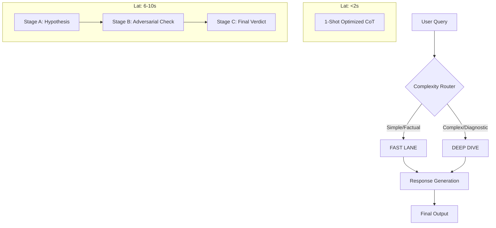

# Hybrid Agricultural Chatbot - Integration & Reproduction Guide

> **Version**: 3.0 (Hybrid Architecture - Fast Lane + Deep Dive)
> **Goal**: Enable developers and AI agents to reproduce, integrate, and extend the Agrow-AI chatbot.

---

## 1. High-Level Architecture

The system uses a **Hybrid Routing Architecture** to balance latency and depth.



### Key Differences
| Feature | **Fast Lane** 🏎️ | **Deep Dive** 🤿 |
|:---|:---|:---|
| **Use Case** | Status checks, simple lookups, greeting | Complex diagnosis, conflicting data, causality |
| **LLM Calls** | 1 Call (Internal CoT) | 3 Calls (Chain of Agents) |
| **Context** | Ultra-Compact (Key metrics only) | Full Context (All bands, history, zones) |
| **Prompt** | `FAST_LANE_PROMPT` | `DEEP_DIVE_HYPOTHESIS`, `ADVERSARY`, `JUDGE` |

---

## 2. Directory Structure & Files

Ensure your `LLM_pipeline` directory contains these verified files:

```
LLM_pipeline/
├── reasoning_engine.py       # CORE LOGIC: Router, Fast Lane, Deep Dive execution
├── prompts.py               # PROMPTS: System, Fast Lane, Deep Dive (A/B/C), Response
├── context_aggregator.py    # DATA: Fetches & compacts data from pipelines
├── intent_classifier.py      # UTIL: Directs query to specific intents
├── architecture_demo.ipynb   # DEMO: Runnable notebook with Dummy Data & Groq Integration
└── models.py                # SCHEMAS: Pydantic models for I/O
```

---

## 3. Reproduction Steps (For Agents)

To reproduce this system from scratch, follow these logic blocks.

### Step A: Initialize the Engine
The `ReasoningEngine` is the main entry point. It requires an LLM caller function.

```python
from reasoning_engine import ReasoningEngine
# 1. Define LLM Caller
def call_llm(prompt: str) -> str:
    # Connect to Groq/OpenAI/Gemini
    return client.chat.completions.create(..., messages=[{"role": "user", "content": prompt}])

# 2. Init Engine
engine = ReasoningEngine(llm_caller=call_llm)
```

### Step B: The Routing Logic (`reasoning_engine.py`)
Implement `route_query(query, intent)`:
*   **IF** Intent in `['greeting', 'capabilities', 'simple_status']` OR keywords in query → **RETURN `FAST_LANE`**
*   **ELSE** → **RETURN `DEEP_DIVE`**

### Step C: The Fast Lane Logic
1.  **Context**: Call `aggregator.build_ultra_compact_context(full_context)`.
2.  **Prompt**: Use `prompts.FAST_LANE_PROMPT`.
3.  **Execution**: Single LLM call. Output JSON with `reasoning_trace`.

### Step D: The Deep Dive Logic
1.  **Stage A (Hypothesis)**:
    *   Context: `aggregator.build_deep_dive_context(..., stage="hypothesis")`
    *   Goal: Generate 2-3 possible causes.
2.  **Stage B (Adversary)**:
    *   Input: Hypotheses from A + `ADVERSARY_PROMPT`.
    *   Goal: Attack the hypotheses using contradicting data.
3.  **Stage C (Judge)**:
    *   Input: Surviving hypothesis + `JUDGE_PROMPT`.
    *   Goal: Final diagnosis + Action Plan.

---

## 4. Integration Guide (Frontend/App)

The frontend needs to send a JSON payload and handle the text response.

### 4.1 Input Payload
Send this to your Python backend (FastAPI/Flask):

```json
{
  "query": "Why is my wheat yellowing?",
  "user_id": "12345",
  "context_overrides": {
    "persona": {
       "description": "New Farmer",
       "instructions": "Style: Simple. NO EMOJIS. NO NUMBERS."
    },
    "farmer_context": {
       "irrigation": "Drip",
       "technique": "Organic"
    }
  }
}
```

### 4.2 Output Format
The `ReasoningEngine.process_query()` returns a tuple: `(response_text, detailed_trace)`.

**User-Facing Response (`response_text`)**:
*   Formatted as Markdown.
*   **Bold Headers**: **DIAGNOSIS**, **REASONING**, **RISKS**, **RECOMMENDATIONS**.
*   **Bullets**: Asterisks (`*`).
*   **No Emojis**.
*   **Closing Question**: "Should I help you...?"

**Debugging/Trace (`detailed_trace`)**:
*   Contains `routing_mode` ("FAST_LANE" or "DEEP_DIVE").
*   Contains intermediate reasoning steps (hypotheses, evidence used).
*   Use this to show "Thinking..." steps in the UI.

---

## 5. Code Snippets for Key Components

### 5.1 Persona Injection
In `prompts.py`, ensure `SYSTEM_PROMPT` enforces the persona.

```python
# prompts.py
SYSTEM_PROMPT = """You are AGROW AI, a dedicated PERSONAL agricultural advisor...
COMMUNICATION STYLE:
- Use "I", "We", "Your field".
- No robotic assertions.
- ...
"""
```

### 5.2 Response Formatter
In `prompts.py`, `RESPONSE_PROMPT` defines the final look.

```python
# prompts.py
RESPONSE_PROMPT = """
...
**DIAGNOSIS & STATUS**
* ...
**NEXT STEPS**
* End with a specific question...
GUIDELINES:
* NO EMOJIS.
* Use asterisk (*) for bullets.
"""
```

### 5.3 Module Reloading (For Development)
If updating code dynamically, always use `importlib.reload`:

```python
import importlib
import prompts, reasoning_engine
importlib.reload(prompts)
importlib.reload(reasoning_engine)
```

---

## 6. How to Extend

*   **Add New Persona**: Edit `PERSONA_DEFINITIONS` in `prompts.py`.
*   **Add New Data Source**: Update `ContextAggregator.build_deep_dive_context` to include the new key.
*   **Change Routing Rules**: Modify `ReasoningEngine.route_query` method.

---
**Prepared by**: Antigravity Agent
**For**: Integration & Reproduction
**Date**: Dec 9, 2025
